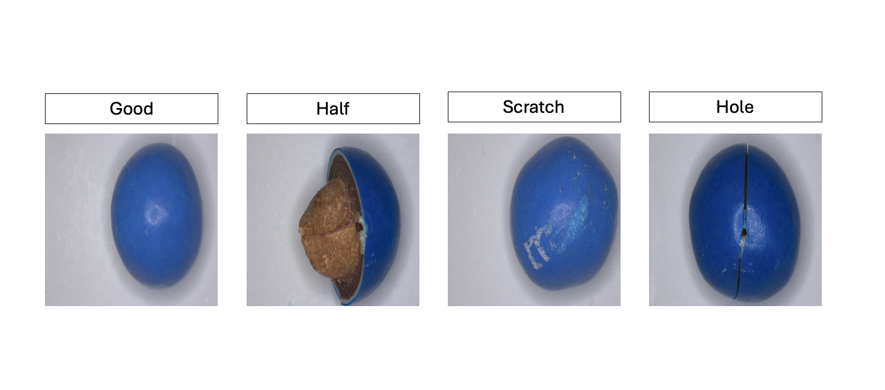

# TinyGLASS: Real-Time Self-Supervised In-Sensor Anomaly Detection**

Pietro Bonazzi, Rafael Sutter, Luigi Capogrosso, Mischa Buob, Michele Magno

[ArXiv Preprint Link](https://arxiv.org/abs/2603.16451) &
[Dataset Link](https://zenodo.org/records/19186667) &
[Model Checkpoints](https://huggingface.co/pietrobonazzi/TinyGLASS)

## Table of Contents
* [📖 Introduction](#introduction)
* [🔧 Environments](#environments)
* [📊 Data Preparation](#data-preparation)
* [🚀 Run Experiments](#run-experiments)
* [📦 Pretrained Checkpoints](#pretrained-checkpoints)
* [🎥 IMX500 Demo](#imx500-demo)
* [📂 Dataset Release](#dataset-release)
* [🔗 Citation](#citation)
* [🙏 Acknowledgements](#acknowledgements)
* [📜 License](#license)

## Introduction
This repository contains source code for TinyGLASS implemented with PyTorch.
TinyGLASS, a lightweight adaptation of the GLASS framework designed for real-time in-sensor anomaly detection on the Sony IMX500.

## Environments
Create a new virtual environment with [uv](https://docs.astral.sh/uv/) and install required packages.
```
uv sync
```
Experiments are conducted on 3x NVIDIA A6000 (48GB).
Same GPU and package version are recommended.

## Data Preparation
The public datasets employed in the paper are listed below.

- MMS ([Download link](https://zenodo.org/records/19186667))
- MVTec AD ([Download link](https://www.mvtec.com/company/research/datasets/mvtec-ad/))

Download the DTD texture dataset for augmentation:
```
wget https://www.robots.ox.ac.uk/~vgg/data/dtd/download/dtd-r1.0.1.tar.gz
tar -xzf dtd-r1.0.1.tar.gz -C <mvtec_path>
```

Expected directory structure:
```
<mvtec_path>/
├── bottle/
├── cable/
├── ...
└── dtd/
    └── images/

<mms_path>/
├── mms_rpi/
└── mms_stretch/
```

Other valuable datasets:

- VisA ([Download link](https://github.com/amazon-science/spot-diff/))
- MPDD ([Download link](https://github.com/stepanje/MPDD/))

## Run Experiments
To reproduce the results in the paper please run:

```
bash shell/run_all.sh
```

Or train individual datasets:

```bash
# MVTec (GPU 0 — first 8 classes)
bash shell/run_tinyglass_mvtec_gpu0.sh

# MVTec (GPU 1 — remaining 7 classes)
bash shell/run_tinyglass_mvtec_gpu1.sh

# MMS dataset
bash shell/run_tinyglass_mms.sh
```

## Pretrained Checkpoints

Pretrained model checkpoints are available on [HuggingFace](https://huggingface.co/pietrobonazzi/TinyGLASS).

```python
from huggingface_hub import snapshot_download
snapshot_download(repo_id="pietrobonazzi/TinyGLASS", local_dir="checkpoints")
```

| Dataset | Classes | Image AUROC |
|---------|---------|------------|
| MMS (mms_rpi) | 1 | in progress |
| MVTec AD | 15 | in progress |

## IMX500 Demo

`demo_imx500.py` supports two modes:

**Image mode** — run on any machine with a checkpoint:
```bash
# Download checkpoint
python -c "
from huggingface_hub import hf_hub_download
hf_hub_download('pietrobonazzi/TinyGLASS',
    'models/backbone_0/mvtec_mms_rpi/ckpt_best_1.pth',
    local_dir='checkpoints')
"

# Run inference and save heatmap
uv run python demo_imx500.py image \
    --checkpoint checkpoints/models/backbone_0/mvtec_mms_rpi/ckpt_best_1.pth \
    --input path/to/image.png \
    --threshold 0.5
```

**Live mode** — Raspberry Pi with IMX500 camera:
```bash
uv run python demo_imx500.py live \
    --rpk path/to/network.rpk \
    --checkpoint checkpoints/models/backbone_0/mvtec_mms_rpi/ckpt_best_1.pth \
    --threshold 0.5
```

The live view shows three panels side by side: raw camera frame | CPU GLASS heatmap | IMX500 NPU heatmap. Press `q` to exit.

## Dataset Release

### 1.MMS Dataset ([Download link](https://zenodo.org/records/19186667))
The MMS Dataset comprises four defect categories for M&Ms candies, i.e., crack-hole, scratch, half, and normal, covering structural and surface-level anomalies. It was collected using an high-resolution microscope camera (mms_stretch) and the IMX500 camera (mms_rpi)



## Citation
Please cite the following paper if the code and dataset help your project:

```bibtex
@misc{bonazzi2026tinyglassrealtimeselfsupervisedinsensor,
      title={TinyGLASS: Real-Time Self-Supervised In-Sensor Anomaly Detection}, 
      author={Pietro Bonazzi and Rafael Sutter and Luigi Capogrosso and Mischa Buob and Michele Magno},
      year={2026},
      eprint={2603.16451},
      archivePrefix={arXiv},
      primaryClass={cs.CV},
      url={https://arxiv.org/abs/2603.16451}, 
}
```

## Acknowledgements
Thanks for the great inspiration from [GLASS](https://github.com/cqylunlun/GLASS).

## License
The code and dataset in this repository are licensed under the [MIT license](https://mit-license.org/).
